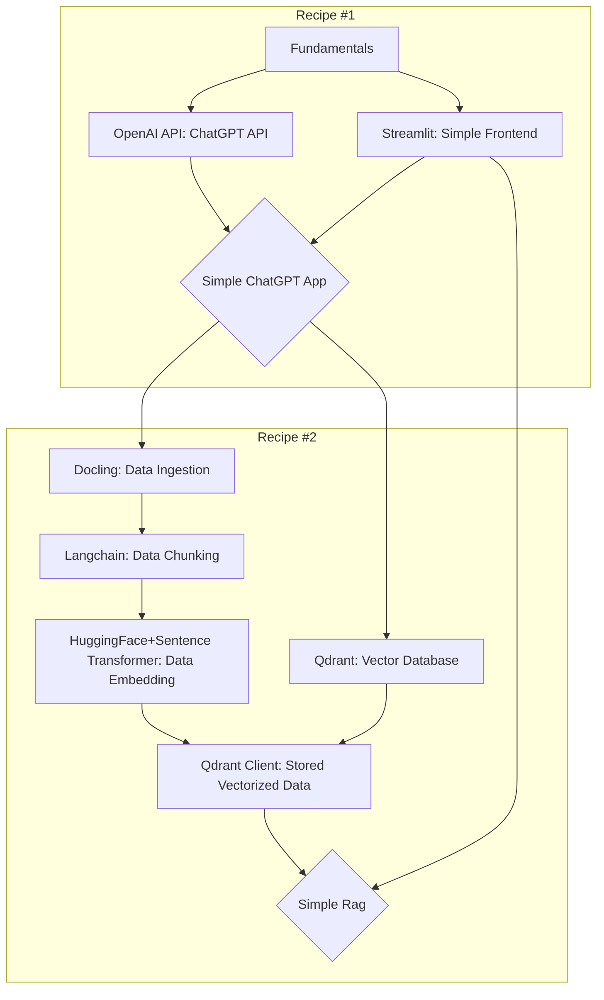

# RAG Cookbook Recipes

## Abstract
With new LLMs, different techniques, and AI implementations, it is not only easy to get overwhelmed as a newcomer who just wants to start building something with LLMs, but also to fall into somebody else's agenda to pitch a specific framework for the newcomer to believe that that framework is the best solution for them. This repo acts as a starting point — a cookbook for anyone who might be stuck in the development journey, while not being steered into using a specific tool or specific AI framework (LangChain, LlamaIndex, etc.).

## Why This Repository?
The philosophy of this repo is: Minimum effort, maximum satisfaction — with no personal agenda to pitch any product. The recipes must be simple to follow with clear goals in mind, indicating which recipe should be followed to achieve specific outcomes. 

Once you get to know some recipes, it becomes easy to mix and match different recipes to get the desired outcome. This repository chooses to avoid implementing the latest techniques or complex implementations if they do not have a clear niche that they are resolving — that other implementations cannot achieve at a similar performance but at a fraction of the complexity.

Each recipe has the following:
- Title as the recipe outline
- Set of questions the recipe is solving
- References where you can read more about anything mentioned in the recipe
- Code implementation with comments
- `requirements.txt` for each recipe


## Recipe Guide Map
If you are just starting out in the world of Gen AI and don't know where to start, here is a simple guidemap of what to follow and in what order. Diamond shape rectangles are outcomes of each recipe. You do not have to follow in the exact order if you already know the tools that are specified by the square rectangles. The first part of the text specify the tool (or in most cases python package of interest) followed by a colon that explain what you will get out of using the tool. For example: "Streamlit: Simple Frontend", meaning - you will make a simple frontend by using streamlit python package.



### Note:
- Use Python version 3.12
- It is recommended, at the beginning, to isolate each recipe in its own virtual environment; however, recipes should all be runnable from a single virtual environment, as `pip`/`uv` will manage package dependencies on behalf of the user. 
    - Each virtual environment is recommended to sit inside the recipe folder.
    - All scripts should run from recipe directory, instead of /app folder.
        - e.g. ```streamlit run app/main.py``` OR ```python3 app/stage_1_process_files.py```

<br />

Project Checkpoints:
- [X] Basic Implementations to use chatGPT
    - [X] Simple Chatbot
    - [X] Simple Rag
- [ ] How to set up basic monitoring 
    - [ ] Monitoring costs and usage of particular individuals
    - [ ] Logging for Errors and malfunctions
    - [ ] Latency Monitoring


Repository Mangement Checkpoints:
- [ ] merge all virtual environments together
- [ ] Set up unit tests for recepies 
- [ ] Set up branch Rules of the repository
